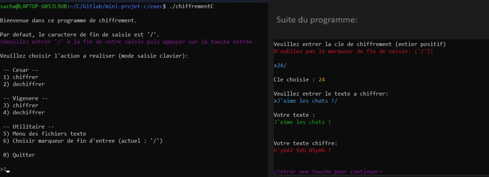
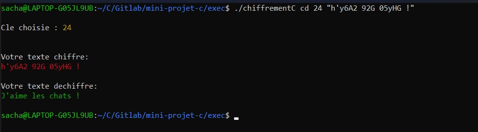

# Projet : Chiffrement de message

<h2>Ce programme permet de chiffrer et déchiffrer des messages via le chiffrement César et Vigenère.</h2>

<p>Il possède une interface intéractive en ligne de commande:

<br>
Il est également possible de directement chiffrer ou dechiffrer en une seule ligne de commande :
</p>

## Installation

Ce programme ne nécessite pas d'être installer. 
<br>Il suffit de lancer 'chiffrementC.exe' sur windows ou,'chiffrementC' sur linux.
<br>Il est possible de recompiler le programme sur linux a l'aide du fichier makefile inclut. 
<br><br>Il suffit de se place dans ./exec et faire:
```bash
    make
```

## Utilisation

```bash
TODO
```

## Contributeurs

Les contributeurs de ce projets sont : 
DA SILVA Olivier, PERNAK Sacha

## License

[GPLv3](https://www.gnu.org/licenses/gpl-3.0.fr.html)
